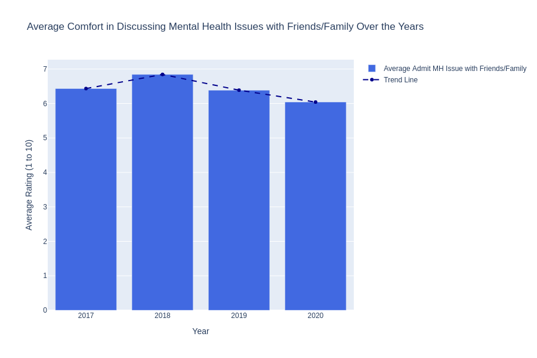
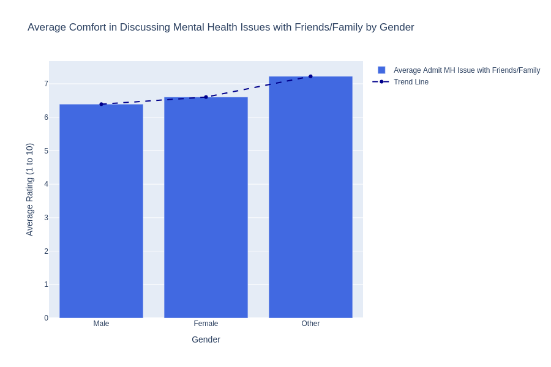
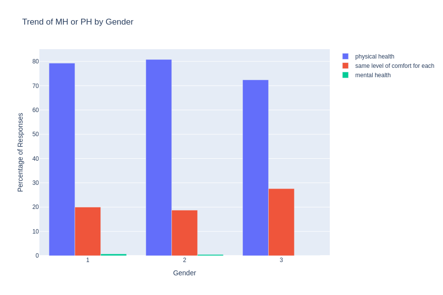

# Workplace Mental Health Trends (2016–2020) Observations

## *Year-over-Year Trends Analysis*

### Prevalence of Mental Health Conditions

- **Family History**: Consistently high (48% to 52%) across all years, suggesting a strong genetic or familial link to mental health disorders.
- **Past and Current Mental Health Disorders**: 
  - Slight increase from 2017 to 2018, potentially due to heightened awareness from social movements like #MeToo.
  - Gradual decline from 2018 to 2020.
- **Significant Drop in 2020**: Likely influenced by the COVID-19 pandemic, causing stress, isolation, and limited access to mental health services. This may have impacted reporting behaviors rather than indicating a true decrease in mental health issues.
  
### Workplace Support
#### Trends in Workplace Mental Health Support Over the Years (Percentage)

- All three categories (Employer Discussion, Resources Provided, and Anonymity Protected) showed an upward trend from 2017 to 2020, indicating a positive shift in workplace mental health support due to growing awareness, changing workplace culture, and legal/ethical considerations.
- Employer discussions consistently ranked highest, showing that initiating mental health conversations is crucial to setting the foundation for further support through a proactive approach and stigma reduction.
- Resources provided and anonymity protection also increased but with slightly lower percentages compared to Employer Discussion, emphasizing the importance of offering practical support through counseling and ensuring trust via anonymity.
- A significant rise in all categories in 2020 likely reflected the impact of the COVID-19 pandemic, which increased stress, remote work challenges, and empathy, highlighting the need for workplace mental health support.

#### Employer Importance Ratings for Mental and Physical Health Over the Years

#### Trends in Ease of Requesting Medical Leave for Mental Health Issues Over the Years

### Comfort Discussing Mental Health

#### Trends in Openness Regarding Mental and Physical Health Discussions During Interviews Over the Years

#### Trends in Comfort Level for Discussing Mental Health Issues Over the Years with friends and faily

#### Trends in Mental Health and Physical Health Openness Over the Years

### Demographic Insights based on gender 
#### Prevalence of Mental Health Disorders by Gender (Percentage)

#### Gender-based Trends in Openness Regarding Mental and Physical Health Discussions During Interviews

#### Gender-based Trends in Comfort Level for Discussing Mental Health Issues with Friends and Family

#### Gender-based Comfort in Discussing Mental Health and Physical Health Issues

